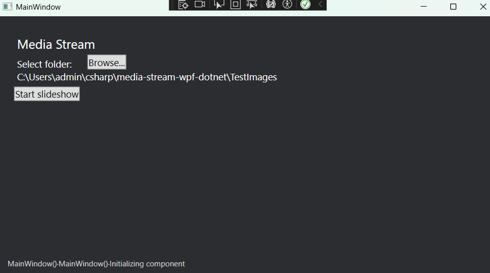

# 📸 MediaStream – Dynamic Slideshow for Images & Videos

MediaStream is a real-time media player that automatically plays images and videos from a folder. 
Perfect for **photo booths, event displays, and digital signage**, 
it seamlessly updates when new media is added—no need to restart the slideshow! 🎥✨
It is programmed in C# WPF .net by S. Ditlefsen.

How it works:
1. Select folder where your pictures and videoes are located


2. Select "Start Slideshow". 


3. Move mouse to view the controls: 

 
4. Drop new files into the folder and they will be added to the slideshow automatically! Perfect for picture booths!

## Download 

 [Download MediaStreamSetup.exe](https://github.com/ditlef9/x/raw/refs/heads/main/Installer/Output/MediaStreamSetup.exe)
(Licensed under 
[Apache License 2.0](https://www.apache.org/licenses/LICENSE-2.0))

THE SOFTWARE IS PROVIDED "AS IS", WITHOUT WARRANTY OF ANY KIND, EXPRESS OR IMPLIED, INCLUDING BUT NOT LIMITED TO THE WARRANTIES OF MERCHANTABILITY, FITNESS FOR A PARTICULAR PURPOSE AND NONINFRINGEMENT. IN NO EVENT SHALL THE AUTHORS BE LIABLE FOR ANY CLAIM, DAMAGES OR OTHER LIABILITY, WHETHER IN AN ACTION OF CONTRACT, TORT OR OTHERWISE, ARISING FROM, OUT OF OR IN CONNECTION WITH THE SOFTWARE OR THE USE OR OTHER DEALINGS IN THE SOFTWARE.

## 🚀 Features
- ✅ **Auto-Updating Slideshow** – Instantly plays new images & videos when added.
- ✅ **Supports Multiple Formats** – Works with `.jpg`, `.png`, `.mp4`, `.mov`, etc.
- ✅ **Smooth Transitions** – Provides a seamless viewing experience.
- ✅ **Folder Watching** – Detects and adds new files automatically.
- ✅ **Customizable Playback Speed** – Adjust transition times.
- ✅ **Lightweight & Fast** – Uses minimal system resources.

## 🎯 Use Cases
- **Photo Booths** – Instantly display pictures & videos taken at events.
- **Event Displays** – Perfect for conferences, weddings, or exhibitions.
- **Digital Signage** – Auto-updating promotional content.
- **Memory Slideshows** – Continuous playback of family photos & videos.

## Content 

1. [🛠 Installation](#-installation)
2. [📂 to Use](#-how-to-use)
3. [⚙️ Create installation file](#-create-installation-file)
4. [📜 License](#-license)

## 1 🛠 Installation
1. **Clone the repository**:
   ```sh
   git clone https://github.com/ditlef9/media-stream-wpf-dotnet.git
   cd MediaStream
   ```
2. **Open the project in Visual Studio**.
3. **Build & Run** the WPF application.

## 2 📂 How to Use
1. Place images & videos in the selected folder.
2. Run the app – it will start playing automatically!
3. Add new media anytime, and it will appear instantly.


## 3 ⚙️ Create installation file

1. Download Inno Setup: https://jrsoftware.org/isdl.php
2. Visual Studio > Build > Publish MediaStream


## 4 📜 License
This project is licensed under the
[Apache License 2.0](https://www.apache.org/licenses/LICENSE-2.0).

```
Copyright 2024 github.com/ditlef9

Licensed under the Apache License, Version 2.0 (the "License");
you may not use this file except in compliance with the License.
You may obtain a copy of the License at

    http://www.apache.org/licenses/LICENSE-2.0
```

## 🤝 Contributing
Pull requests are welcome! If you have suggestions for improvements, feel free to open an issue or create a PR.

## 📬 Contact
For questions or support, reach out via **[GitHub Issues](https://github.com/ditlef9/media-stream-wpf-dotnet/issues)**.

---
Made with ❤️ by Sindre
